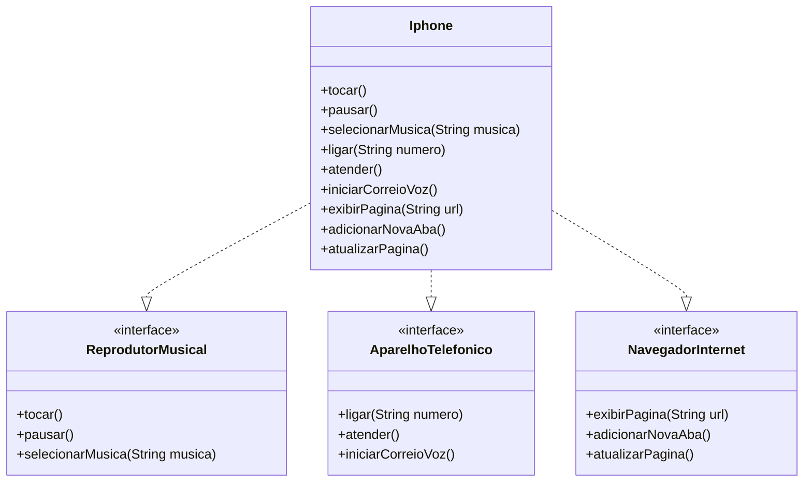

```mermaid
classDiagram
    class ReprodutorMusical {
        <<interface>>
        +tocar()
        +pausar()
        +selecionarMusica(String musica)
    }

    class AparelhoTelefonico {
        <<interface>>
        +ligar(String numero)
        +atender()
        +iniciarCorreioVoz()
    }

    class NavegadorInternet {
        <<interface>>
        +exibirPagina(String url)
        +adicionarNovaAba()
        +atualizarPagina()
    }

    class Iphone {
        +tocar()
        +pausar()
        +selecionarMusica(String musica)
        +ligar(String numero)
        +atender()
        +iniciarCorreioVoz()
        +exibirPagina(String url)
        +adicionarNovaAba()
        +atualizarPagina()
    }

    Iphone ..|> ReprodutorMusical
    Iphone ..|> AparelhoTelefonico
    Iphone ..|> NavegadorInternet

```